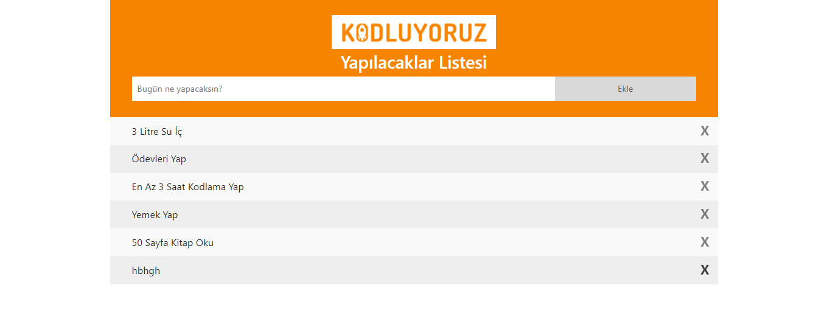

# Patika.dev Javascript Homework-2

- Javascript modülünün ikinci ödevi To Do List projesidir.
- Kullanıcı görevlerini metin kutusuna girerek aşağıya ekleyebilir.
- Boş ekleme yapılamamaktadır. Bu durumda uyarı verilmektedir.
- Kullanıcı gerçekleştiği görevleri çarpı simgesine tıklayarak kaldırabilmektedir.

---

